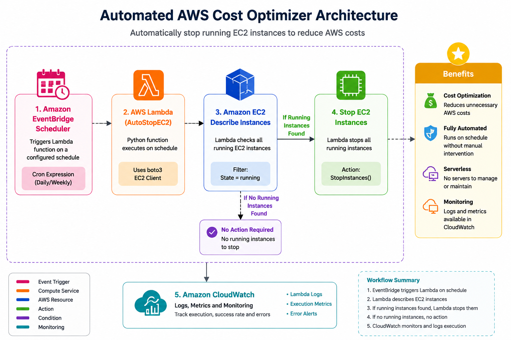

# AWS Automated Cost Optimizer

## Project Overview

This project automatically stops running Amazon EC2 instances on a schedule using AWS Lambda and Amazon EventBridge Scheduler to reduce unnecessary AWS costs.

The solution is fully serverless and requires no manual intervention after deployment.


## Architecture



### Workflow

1. Amazon EventBridge Scheduler triggers the Lambda function on a scheduled basis.
2. AWS Lambda executes Python code using boto3.
3. Lambda checks all EC2 instances in the AWS account.
4. Running instances are identified.
5. Lambda stops running EC2 instances automatically.
6. Amazon CloudWatch records logs and execution metrics.

## AWS Services Used

- AWS Lambda
- Amazon EC2
- Amazon EventBridge Scheduler
- Amazon CloudWatch
- AWS IAM
- boto3 (AWS SDK for Python)

## Project Structure

```text
AWS-Cost-Optimizer/
│
├── lambda_function.py
├── README.md
└── screenshots/
    ├── architecture.png
    ├── lambda-monitor.png
    ├── eventbridge-schedule.png
    └── ec2-stopped.png

##  Lambda Function

```python
import boto3

ec2 = boto3.client('ec2')

def lambda_handler(event, context):

    response = ec2.describe_instances()

    instance_ids = []

    for reservation in response['Reservations']:
        for instance in reservation['Instances']:
            if instance['State']['Name'] == 'running':
                instance_ids.append(instance['InstanceId'])

    if instance_ids:
        ec2.stop_instances(InstanceIds=instance_ids)

    return {
        'statusCode': 200,
        'body': f'Stopped {len(instance_ids)} instances'
    }
```

---

##  Project Screenshots

### Lambda Monitoring

[Lambda Monitoring](screenshots/lambda-monitor.png)

### EventBridge Schedule

[EventBridge Schedule](screenshots/eventbridge-schedule.png)

### EC2 Instance Stopped

[EC2 Stopped](screenshots/ec2-stopped.png)


##  Features

- Automated EC2 shutdown
- Cost optimization
- Serverless architecture
- Event-driven scheduling
- CloudWatch monitoring
- AWS Lambda automation
- Python and boto3 integration

##  Results

- Successfully automated EC2 instance management.
- Reduced unnecessary AWS compute costs.
- Achieved 100% successful Lambda execution.
- Implemented monitoring using CloudWatch metrics.


##  Use Case

Organizations often leave EC2 instances running after work hours, resulting in unnecessary cloud costs.

This project automatically stops unused running instances on a predefined schedule, helping reduce AWS spending.


## Author
Priyanka Mandve

GitHub: https://github.com/Priyanka-Mandve


## Future Enhancements

- Stop only tagged instances
- Send email notifications using Amazon SNS
- Start instances automatically during business hours
- Generate cost-saving reports
- Multi-account automation
